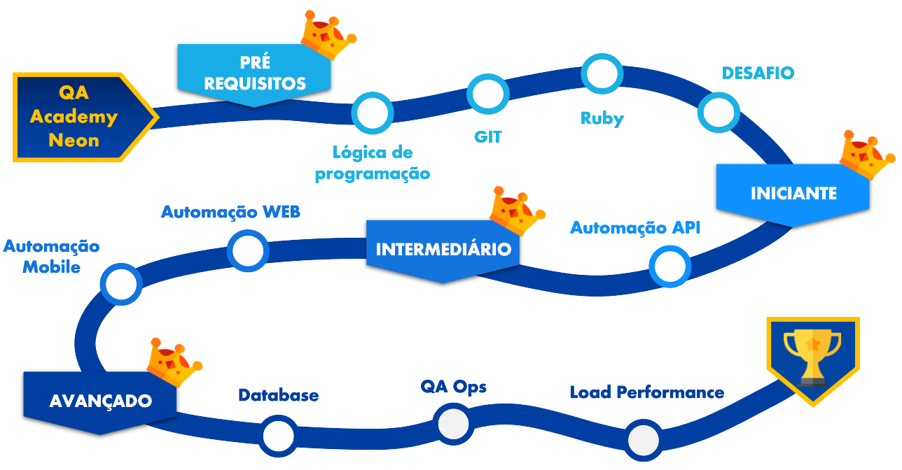

# Trilha de Conhecimento Neon
Repositorio pessoal do Erick Ribeiro para responder aos desafios propostos na Academia de QA da Neon



## Modulo GIT
Ao finalizar os treinamento, deverá ser entregue o link de um repositório criado com um arquivo README.MD com os principais comandos aprendidos.

### Git Clone

Tem por finalidade baixar um repositorio para seu ambiente local ele cria um clone do repositorio no diretorio em que se encontra.

```
git clone https://github.com/erick-ribeiro/treinamento_fundamentos.git
```

### Git Branch

Tem por finalidade gerar uma nova ramificação do seu projeto, é util quando vai adicionar novas funcionalidades no codigo ou efetuar correções quando se tem varias pessoas trabalhando no mesmo projeto  

```
git branch treinamento_git
```

### Git Checkout

Tem por finalidade alternar entre as branchs de seu repositorio 

```
git checkout treinamento_git

#tips caso deseje criar e efetuar o checkout em uma branch nova poode utilizar 
git checkout -b treinamento_git
```

### Git Add

Tem por finalidade adicionar os arquivos que sofreram alterações na Staging Area

```
git add Readme.md
```

### Git Commit

Tem por finalidade mover os arquivos alterados para o Git Directory

```
git commit -m "Inclusão da resolução da atividade do desafio 1"
```

### Git Push

Tem por finalidade mover os arquivos foram commitados e estão no Git Directory para o repositorio remoto.

```
git push <remote> <branch>

#se sua branch foi criada recentemente sera necessario enviar ela para o repositorio juntamente com seu commit
git push -u origin <branch>

```

## Modulo Logica de Programação
Neste modulo foram vistos os videos de logica de programações popostos no modulo. 

Não foi feito atividade pois o mesmo sera validado duerante o modulo de Ruby

## Modulo Ruby
Ao finalizar os treinamento, deverá ser entre todos os desafios do módulo em um repositório utilizando git.

### O Início
#### Atividade 1
Exiba no console a seguinte mensagem “Curso de Ruby do OneBitCode”

````
ruby exercise/modulo_ruby/task_1.1.rb
````

### Conceitos Básicos
#### Atividade 1
Crie todos os principais tipos de dados mencionados na aula com valores diferentes dos exemplos.

````
ruby exercise/modulo_ruby/task_2.1.rb
````
#### Atividade 2
Crie um programa que receba o nome e idade de uma pessoa e no final exiba estes dois dados em uma única frase.
````
ruby exercise/modulo_ruby/task_2.2.rb
````

#### Atividade 3
Crie um programa que que receba dois números inteiros e no final exiba a soma, subtração, adição e divisão entre eles.
````
ruby exercise/modulo_ruby/task_2.3.rb
````

### Estruturas de Controle
#### Atividade 1
Utilizando as estruturas de iteração e condição, crie uma calculadora que ofereça ao usuário a opção de Multiplicar, Dividir, Adicionar ou Subtrair dois números. Não se esqueça de também permitir que o usuário feche o programa.
````
ruby exercise/modulo_ruby/task_3.1.rb
````

### Collections
#### Atividade 1
Utilizando uma collection do tipo Array, escreva um programa que receba 3 números e no final exiba o resultado de cada um deles elevado a segunda potência.
````
ruby exercise/modulo_ruby/task_4.1.rb
````
#### Atividade 2
Crie uma collection do tipo Hash e permita que o usuário crie três elementos informando a chave e o valor. No final do programa para cada um desses elementos imprima a frase “Uma das chaves é **** e o seu valor é ****”
````
ruby exercise/modulo_ruby/task_4.2.rb
````
#### Atividade 3
Dado o seguinte hash:
Numbers = {a: 10, b: 30 2, c: 20, d: 25, e: 15}
Crie uma instrução que seleciona o maior valor deste hash e no final imprima a chave e valor do elemento resultante.
````
ruby exercise/modulo_ruby/task_4.3.rb
````

### Métodos e Gems
#### Atividade 1
Crie um programa que possua um método que resolva a potência dado um número base e seu expoente. Estes dois valores devem ser informados pelo usuário.
````
ruby exercise/modulo_ruby/task_5.1.rb
````